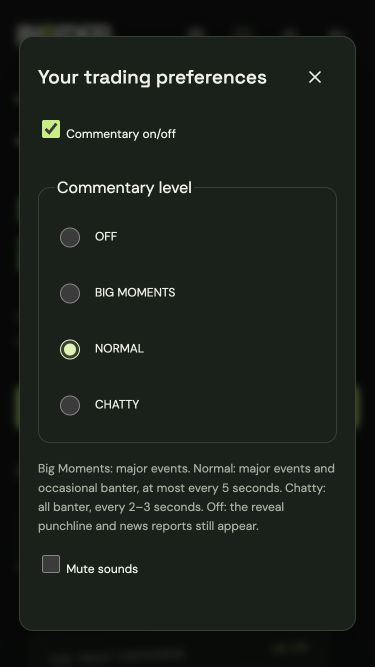
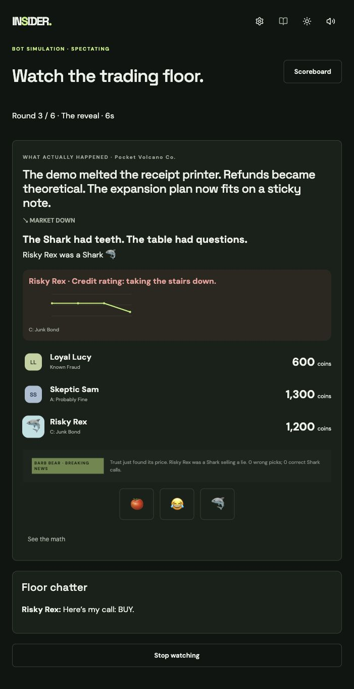

# Comedy and commentary

All 150 news entries have an UP and DOWN punchline. Brad Bull and Barb Bear use 128 prewritten event templates; no AI is invoked for live captions. The existing optional reveal/Closing Bell narrator and deterministic fallbacks remain.

## Public boundary

`buildCommentaryFrame` is an allowlisted projection. It includes the public headline company, posted tip, submission flags, connection state, chat, trust totals, and already-revealed history. It excludes current roles, true direction, news accuracy, picks, stakes, and calls. Commentary receives only this frame. Callback memory derives previous truth/lie streaks, losses and grudges, lost All Ins, trust changes, and repeat companies from public history.

The differential tests vary hidden state while keeping public observations fixed and compare both the frame and commentary output. Numeric scoring and exact Appendix A/B replay tests remain in the suite.

## Pacing and settings

The server emits at most one caption every 2.5 seconds (the one-second housekeeping sweep can make this approximately three seconds). Lines expire after 12 seconds and are discarded on phase/round changes. Clients order high-priority lines first, discard stale lines, and filter by browser-saved level:

| Level       | Lines           | Minimum gap |
| ----------- | --------------- | ----------- |
| OFF         | None            | —           |
| BIG MOMENTS | High            | 5 seconds   |
| NORMAL      | High and medium | 5 seconds   |
| CHATTY      | All             | 2.5 seconds |

The punchline and Breaking News/Closing Bell reports remain visible with commentary OFF. The settings drawer can be opened during any phase. Turning commentary back on does not replay lines already received while off.

## Cosmetic effects

A revealed Shark gets a shark avatar. Losing a 300-coin All In triggers an explosion and BANKRUPT badge through the end of the following round. The badge does not eliminate the player or zero their coins. An applied trust loss of at least 30 triggers the dropping chart and sad trombone, subject to mute. Reduced motion disables travel/morph animations.

Tomato, laugh, and shark reactions are accepted only during REVEAL, at most once per 1.5 seconds per authenticated seat. The server determines identity and timestamp. Reactions are public, expire after 2.5 seconds, and cannot affect scoring or deadlines. Watch-mode observers can react too.

## Content editing

- News outcomes: `server/src/content/news.json`
- Anchor templates and priorities: `server/src/commentary/lines.json`
- Ratings, awards, rotating microcopy and reaction glyphs: `shared/src/content/comedy.json`
- Quick-chat text and role restrictions: `shared/src/content/phrases.json`

Keep jokes about fictional trading decisions and invented companies. Review new content for kindness as well as running validation tests. Automated validation is not an editorial review.

## Screenshots

